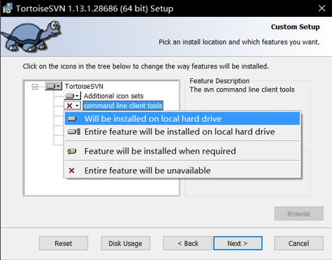
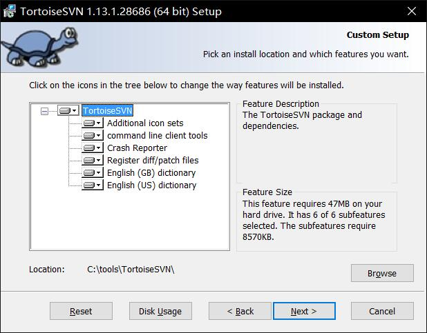
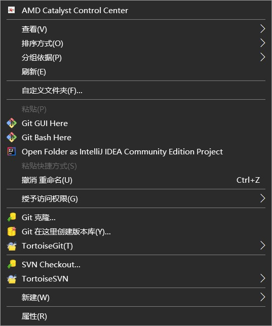
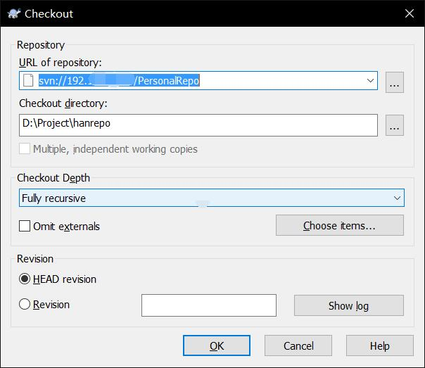
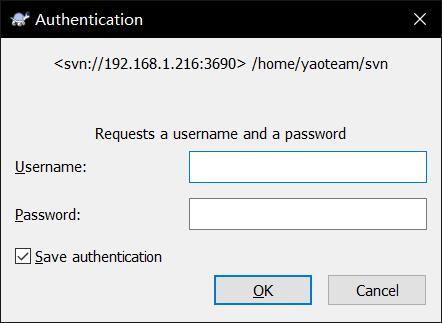

## 前言：

SVN(Subversion)是一种版本控制工具，跟Git原理和操作基本一致

什么是版本控制

把文件系统分为若干个版本，从创建的时刻起称为版本1，后面进行了一些修改或者其他的操作，提交上去后就变成了版本2，记录你的每一次版本操作，就是版本控制的用途。

## 准备环境

1. Windows10
2. [TortoiseSVN](https://tortoisesvn.net/)   中文包可选

## 安装SVN

官网提供的文件主要有三个，安装包、语言包、文档。

双击安装包安装，后续在开发环境(IDEA/Pycharm/VS)中集成SVN工具，需要在选择组件的界面勾选上command line client tools，安装位置自由选择

选好之后是这样

后面直接next就好了

语言包安装没有其他选项，安装位置都不用选，一路默认就好。

安装完成是没有界面显示的，在文件夹中右键鼠标能看见TortoiseSVN的选项即安装成功

## SVN的使用

在服务器仓库已经建立好的情况下，在客户端使用SVN连接服务器

首先要和SVN服务端仓库建立连接，选择一个空的文件夹点击鼠标右键，能看到SVN Checkout 和 TortoiseSVN的选项

点击SVN Checkout，出现选择仓库界面，IP是SVN服务器所在的位置，后面接自己的仓库，路径根据服务器配置的不同不一定一致，下面是自己本地的路径，可以自由选择

如果配置是对的会出现输入账号密码界面，账号密码由管理员设定好。

