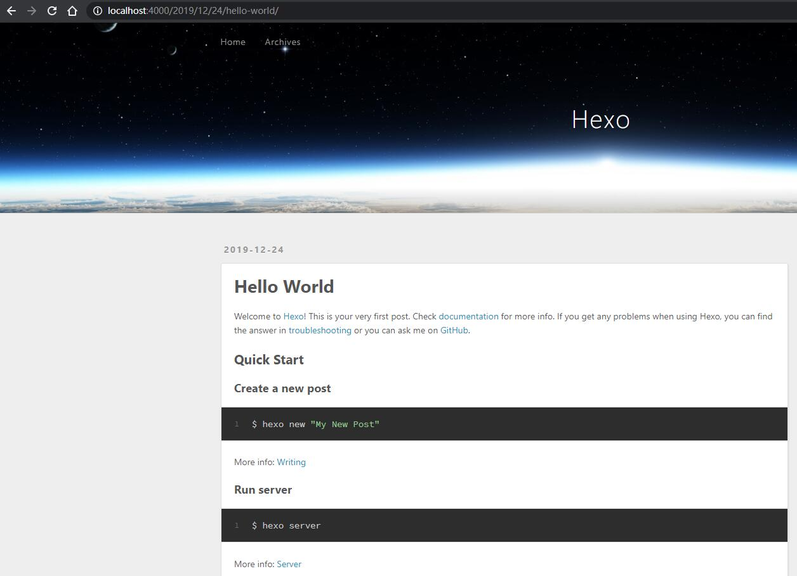
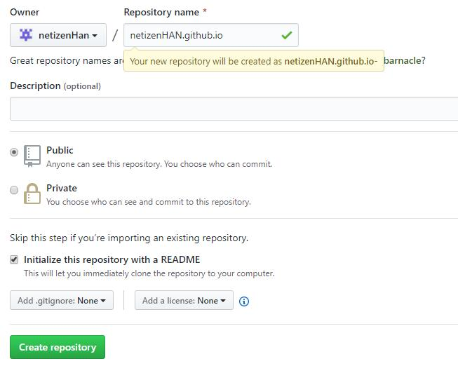
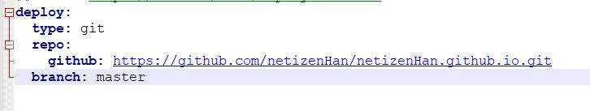

## 准备环境

1. 安装[NodeJS](https://nodejs.org/en/)下载安装，安装位置可选，其他一路默认即可，最后有个是否自动安装相关环境的选项，不建议选择，会自动安装python2和VS2017等基本无关软件，且耗时巨长。
2. 安装git，不会的参考[廖雪峰git教程](https://www.liaoxuefeng.com/wiki/896043488029600)，其他教程都可以

安装完毕后在CMD中输入下面命令，如果出现版本号说明安装成功

```
git version
node -v
npm -v
```

## 安装 Hexo

环境准备好后通过命令行进入自己想要建立的文件夹内输入

在命令行输入执行以下命令：

```
npm install -g hexo-cli
```

安装 Hexo 完成后，再执行下列命令，Hexo 将会在指定文件夹中新建所需要的文件。这里的myBlog是文件夹名字，根据自己需要修改

```
hexo init myBlog
cd myBlog
npm install
```

新建完成后，指定文件夹的目录如下：

```
.
├── _config.yml # 网站的配置信息，您可以在此配置大部分的参数。 
├── package.json
├── scaffolds # 模版文件夹
├── source  # 资源文件夹，除 _posts 文件，其他以下划线_开头的文件或者文件夹不会被编译打包到public文件夹
|   ├── _drafts # 草稿文件
|   └── _posts # 文章Markdowm文件 
└── themes  # 主题文件夹
```

好了，如果上面的命令都没报错的话，就恭喜了，运行 hexo s 命令，其中 s 是 server 的缩写，在浏览器中输入 [http://localhost](http://localhost/):4000 回车就可以预览效果了。

```
hexo s
```

以下是我本地的预览效果



至此，你本地的博客就已经搭建成功，接下来就是部署到 Github Page 了。

在GitHub中创建仓库，并且仓库名必须是名字.github.io，这样github会自动识别这是个githubPage



权限要选public，免费用户无法使用private权限的githubPage

## 部署到 Github

此时，本地和Github的工作做得差不了，是时候把它们两个连接起来了。你也可以查看官网的[部署](https://hexo.io/zh-cn/docs/deployment)教程。
先不着急，部署之前还需要修改配置和安装部署插件。
第一：打开项目根目录下的 _config.yml 配置文件配置参数。拉到文件末尾，填上如下配置：



第二：要安装一个部署插件 [hexo-deployer-git](https://github.com/hexojs/hexo-deployer-git)。

```
npm install hexo-deployer-git --save
```

最后执行以下命令就可以部署上传啦，以下 g 是 generate 缩写，d 是 deploy 缩写：

```
hexo g -d
```

稍等一会，在浏览器访问网址： [https://你的用户名.github.io](https://xn--6qqv7i14ofosyrb.github.io/) 就会看到你的博客啦！！

文章存在source/_posts 下面的md文件

用markdown工具写好文章之后执行命令即可在博客显示

```
hexo g
hexo s
```


